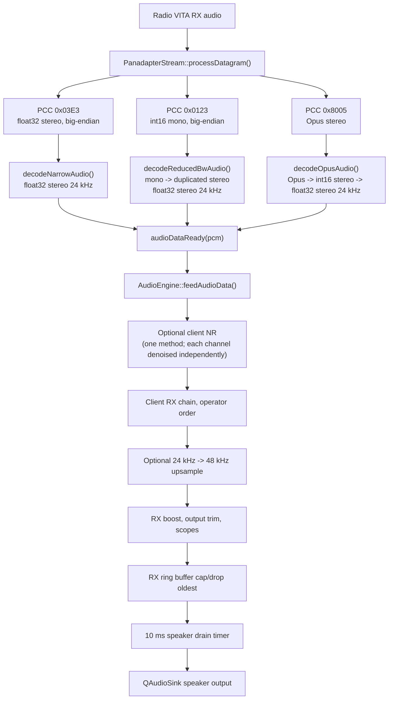
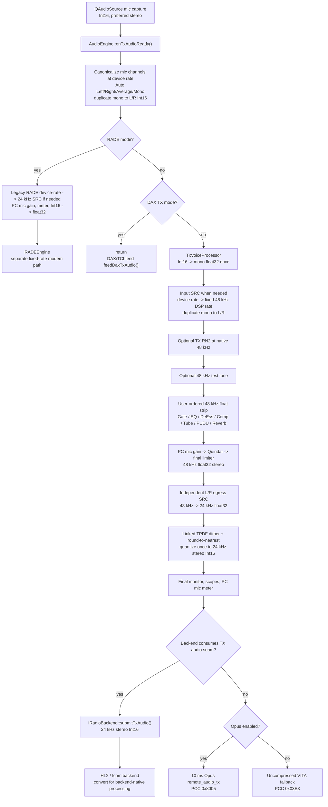
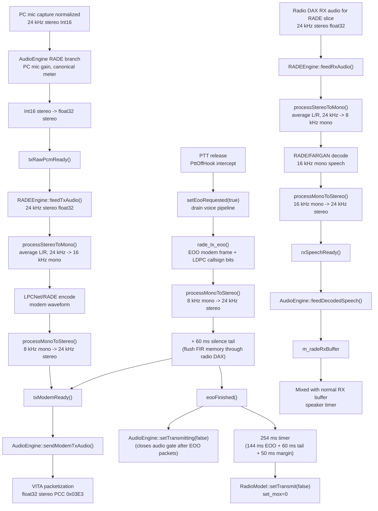
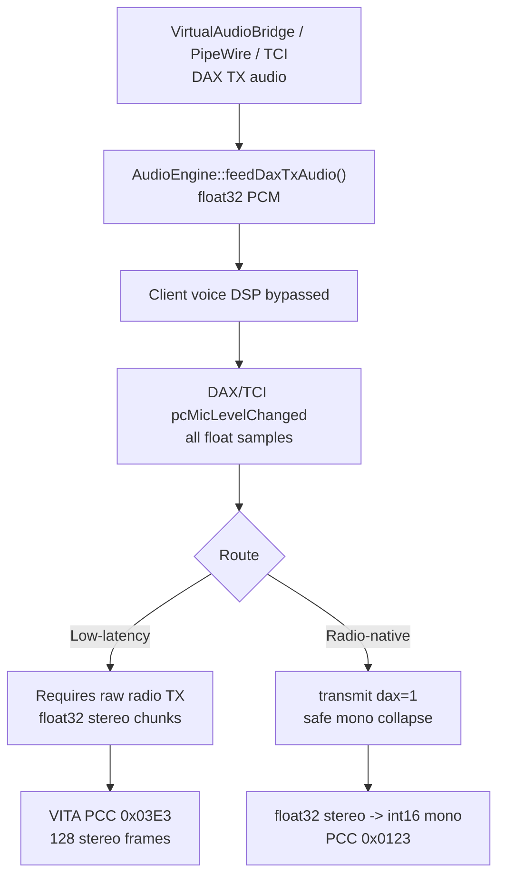

# AetherSDR Audio Pipeline

This document describes the current client-side audio paths in AetherSDR as
implemented in `src/core` and the GUI wiring. It focuses on the details a
contributor needs when changing audio code: ordering, sample formats, sample
rates, channel handling, downmixing, resampling, metering taps, gain stages, and
packetization.

## Executive summary

AetherSDR has several distinct audio paths that share some helpers but do not
all run through the same DSP chain:

- **RX speaker path**: radio audio from `PanadapterStream` is decoded to 24 kHz
  float32 stereo and handed to `AudioEngine::feedAudioData()`. RX noise
  reduction, RX client EQ/Gate/Comp/DeEss/Tube/PUDU, output trim, optional
  24 kHz to 48 kHz upsampling, metering, scopes, and speaker buffering happen
  in `AudioEngine`.
- **Local sidetone / Quindar local output**: CW sidetone and local Quindar
  monitor tones use local output sinks that are independent of the RX speaker
  buffer. They are logically tone generators, represented as stereo output
  frames.
- **PC mic voice TX path**: `QAudioSource` captures Int16 mic audio at the
  negotiated device rate. After channel canonicalization, `TxVoiceProcessor`
  converts to float once, normalizes to a fixed 48 kHz DSP domain, runs optional
  TX RN2 and the complete voice strip, then performs one 48-to-24 kHz conversion
  and one TPDF-dithered Int16 quantization at the existing 24 kHz voice-output
  boundary. That boundary is final for Flex `remote_audio_tx`; HL2 and Icom
  currently consume the same 24 kHz Int16 seam and convert onward inside their
  backends.
- **Opus `remote_audio_tx` path**: the normal PC mic voice path sends 24 kHz
  stereo Int16 frames as 10 ms Opus packets over VITA-49 PCC `0x8005`.
- **RADE TX/RX path**: RADE branches early from PC mic capture and bypasses the
  Opus voice TX path. It uses float32 PCM, converts to the modem rates needed by
  LPCNet/RADE/FARGAN, and packetizes the modem waveform as VITA audio.
- **DAX TX low-latency path**: DAX/TCI float32 stereo audio bypasses client voice
  DSP and is packetized as float32 stereo VITA PCC `0x03E3`.
- **DAX TX radio-native/reduced-bandwidth path**: DAX/TCI float32 stereo audio
  bypasses client voice DSP, is averaged to Int16 mono, and is packetized as
  VITA PCC `0x0123` while the radio-side transmit `dax=1` path is active.

The internal voice and modem paths are mostly **logically mono** but are often
represented as **stereo frames** because the radio/audio interfaces expect
interleaved L/R samples. Important cases:

- PC mic voice TX is canonicalized as duplicated-stereo Int16 at the negotiated
  device rate. Stereo capture is first collapsed to a canonical mono voice
  signal using Auto Left/Right/Average selection. `TxVoiceProcessor` converts
  that signal to float, resamples mono to 48 kHz when needed, and duplicates it
  to L/R for continuous float32 processing.
- Opus `remote_audio_tx` encoder input is always 24 kHz stereo Int16 in 10 ms
  frames.
- RADE modem/speech processing is logically mono, but AudioEngine handoff and
  VITA packetization use 24 kHz stereo float32 frames.
- DAX radio-native TX packets are mono Int16, but the DAX bridge and TCI hand
  float32 stereo frames to `AudioEngine`.
- Reduced-bandwidth RX audio from the radio is Int16 mono and is duplicated to
  float32 stereo for the RX speaker path.

## RX speaker path

### Source and input format

`PanadapterStream::processDatagram()` decodes radio VITA packets and emits
`PanadapterStream::audioDataReady(QByteArray)` for normal speaker audio.
`MainWindow` connects that signal to `AudioEngine::feedAudioData()`.

The speaker path expects the decoded payload handed to `AudioEngine` to be
interleaved float32 stereo at 24 kHz:

- PCC `0x03E3` narrow IF/audio payloads are big-endian float32 stereo and are
  converted to native float32 stereo.
- PCC `0x0123` reduced-bandwidth payloads are big-endian Int16 mono. The decoder
  converts each sample to float32 and duplicates it to L/R.
- PCC `0x8005` Opus payloads are decoded as 24 kHz stereo Int16, then converted
  to float32 stereo.

DAX RX audio is decoded by the same `PanadapterStream` helpers but is emitted as
`daxAudioReady(channel, pcm)` rather than `audioDataReady(pcm)`.

### RX DSP ordering

`AudioEngine::feedAudioData()` is the entry point for local speaker audio. When
the radio is transmitting, the code bypasses RX noise reduction and the client
RX DSP strip and writes the received PCM to the output path directly.

When receiving, the current ordering is:

1. Radio-decoded 24 kHz float32 stereo enters `feedAudioData()`.
2. Optional RX noise reduction runs first. Exactly one method is active (RN2,
   NR2, NR4, DFNR, NNR, BNR, or macOS MNR), and every one of them denoises L
   and R as two independent channels: each side has its own algorithm state
   and, where the method resamples, its own SRC pair. Nothing is averaged to
   mono, so each side keeps its own content: a hard-panned diversity pair keeps
   one antenna per ear, and a pan change is heard as soon as the audio carrying
   it arrives. This is a deliberate trade. A signal present in both channels,
   whether an off-centre slice or a centred one in the radio's mixed stereo
   stream, is suppressed separately on each side, so its L/R balance is not
   held. The quieter copy has the lower SNR and is usually suppressed harder:
   measured on synthetic tones, the shift is under about 1.5 dB with a strong
   signal and grows to several dB as the quieter side nears the noise floor.
   DFNR and BNR can remove a quiet steady carrier on one side entirely. Keeping
   each side's own content and an immediate pan is preferred over the shared
   mask and mono envelope that used to hold the balance.
3. `writeAudio()` runs the client RX strip in this fixed order:
   `ClientEqRx`, `ClientGateRx`, `ClientCompRx`, `ClientDeEssRx`,
   `ClientTubeRx`, `ClientPuduRx`.
4. The RX EQ analyzer tap is taken after RX EQ and before the remaining RX strip.
   It averages L/R to mono for the analyzer buffer.
5. If the selected output sink is running at 48 kHz, `AudioEngine::resampleStereo()`
   upsamples 24 kHz stereo to 48 kHz stereo.
6. Optional RX boost applies `tanh(2*x)` to every sample.
7. RX output trim applies a dB gain multiplier to every sample. For a virtual
   KiwiSDR profile, whose pan is client-side, `applyRxPanInPlace()` then applies
   that profile's pan when it is not centred.
8. `rxPostChainScopeReady` is emitted from the post-chain stereo signal after
   averaging L/R to mono.
9. Audio is appended to `m_rxBuffer`; a 10 ms timer drains the buffer to the
   selected speaker sink.

`AudioEngine::applyClientRxDspFloat32()` currently exists as a dispatcher stub,
but the live RX speaker strip is the explicit order inside `writeAudio()`.

### Pan handling

Radio speaker audio enters as stereo with the radio's per-slice pan already
applied. For a backend that demodulates on this host there is no radio to do
that, so the backend applies it: `applySliceAudioInPlace()` is the ANAN
receiver's mute, AF gain and balance stage, and it runs on the demodulated block
before the speaker feed is published. The per-slice tap (`sliceAudioFrameReady`,
which feeds TCI receiver channels and decoders) is published first, pre-mute and
pre-gain, as the seam contract requires. It uses the same balance law as `applyRxPanInPlace()`
below -- attenuate the opposite channel, never boost either -- so the same
setting is the same loudness whichever kind of receiver it is applied to. Every client NR method denoises L and R independently, preserving
channel separation but not the balance of a signal present in both channels
(see step 2 above). The RX strip and the RX upsampler described below preserve
their input balance. The only client pan stage is `applyRxPanInPlace()` in
`processMixedRxAudioData()`, after output trim, and it runs only for virtual
KiwiSDR profiles: Flex and the legacy Kiwi stream keep the orientation already
present in their input.

### 24 kHz to 48 kHz upsampling

The RX output sink is 24 kHz float32 stereo when the device supports it. On macOS
and Windows, `AudioEngine::startRxStream()` prefers a 48 kHz sink when that is
the reliable device format. In that case the RX speaker path upsamples the 24 kHz
stereo stream to 48 kHz before writing to `QAudioSink`.

`AudioEngine::resampleStereo()` intentionally uses two independent `Resampler`
instances: one for L and one for R. It does **not** call
`Resampler::processStereoToStereo()`, because that helper averages L/R to mono
and duplicates the mono result back to stereo. Using separate L/R resamplers
preserves radio pan and any true stereo content.

RADE decoded speech mixed into the speaker buffer is also resampled when the
speaker sink runs at 48 kHz. That path uses `Resampler::processStereoToStereo()`;
RADE decoded speech is logically mono duplicated to stereo before that point.

### Volume, mute, boost, trim, buffer cap, and timing

- `AudioEngine::setRxVolume()` maps the UI volume to `QAudioSink::setVolume()`
  in the range `0.0..1.0`.
- `AudioEngine::setMuted()` sets the sink volume to `0.0` while muted and
  restores `m_rxVolume` when unmuted.
- RX boost is optional and applies `tanh(2*x)` after any 24 kHz to 48 kHz
  resampling.
- RX output trim is a dB gain stage applied after RX boost.
- `m_rxBufferCapMs` defaults to 200 ms and is clamped to 50..1000 ms. The
  speaker timer drops the oldest samples when the normal RX buffer or RADE RX
  buffer exceeds the cap.
- The speaker drain timer runs every 10 ms, writes only full float32 samples, and
  respects `QAudioSink::bytesFree()`.
- If decoded RADE speech is pending, the speaker timer mixes `m_radeRxBuffer`
  with `m_rxBuffer` sample-by-sample and clamps the mixed output to `[-1, 1]`.

The speaker path also has watchdogs for stale or stuck sinks. It restarts the RX
sink when `bytesFree()` appears stuck, when processed time stops advancing, or
when input has been quiet long enough that the sink likely needs a restart.

### macOS Bluetooth/HFP/telephony output guard

On macOS, Bluetooth devices can expose a telephony/HFP output profile with audio
formats that are unsuitable for AetherSDR speaker playback. During
`startRxStream()`, AetherSDR checks whether the selected output supports the
desired 24 kHz float32 stereo format or a 48 kHz fallback. If it appears to be a
telephony-only output and `allowBluetoothTelephonyOutput` is false, AetherSDR
switches to a safer default or sibling output device.

`AudioEngine::setAllowBluetoothTelephonyOutput()` controls that guard and
restarts the RX sink when the setting changes. `MainWindow` allows Bluetooth
telephony output while PC mic capture is selected, so a headset selected for PC
mic operation is not forcibly moved away from the telephony profile.

### Audio device hotplug handling

`MainWindow` owns Qt audio device change monitoring because user prompting must
run on the GUI thread. `QMediaDevices::audioInputsChanged()` and
`QMediaDevices::audioOutputsChanged()` are debounced before any action is taken.
When at least one new device appears, AetherSDR shows a selection dialog with
the current input/output highlighted, newly detected devices marked, and system
defaults available as explicit choices.

The dialog includes a "Don't ask me again" checkbox. Checking it persists
`SuppressAudioDeviceNotifications=True` in `AppSettings`; future device-add
events skip the selection dialog while preserving the existing fallback to
system default when a selected device disappears.

The same setting is exposed in Radio Setup > Audio > PC Audio Devices as
"Prompt on Audio Device Changes"; that checkbox is checked when notifications
are enabled and unchecked when the suppression setting is active.

On networked Icom radios an operator **click** on the title-bar PC Audio toggle
also requests the voice-mode input selection. On selects the model's network
source in `DATA OFF MOD` (WLAN on IC-705, LAN on IC-7300MK2) and opens PC
microphone capture; off puts back whatever the radio held before the first
request of the session — `MIC` only when nothing was captured — and closes
capture. `DATA MOD` is separate radio-owned state and is never changed by this
toggle.

Only a click writes. `DATA OFF MOD` is a SET-menu register the radio persists,
so Constitution III forbids replaying the client-persisted `PcAudioEnabled` key
onto it: a connect *publishes* the client's PC Audio state
(`RadioModel::notePcAudioEnabled`) so the backend can warn about a mismatch, and
never commands. Without that split an operator who set `DATA OFF MOD` to USB for
a rig interface would find it silently rewritten on every connect. On a model
with no verified SET-menu map the click is refused and says so, rather than
guessing another radio's item numbers.

Accepting the dialog queues `AudioEngine::setInputDevice()` and
`AudioEngine::setOutputDevice()` onto the audio worker thread. Those setters are
the only place that persists the chosen device IDs and restarts the affected
`QAudioSource`/`QAudioSink` paths. Cancel leaves the current selection alone
unless the selected device disappeared during the same change batch, in which
case AetherSDR falls back to the system default device without prompting.

When the accepted selection changes the input device while the radio mic source
is `PC`, `MainWindow` immediately re-arms PC mic capture by restarting the local
`QAudioSource` on the selected device. The radio mic source is not toggled and
no hardware-mic fallback route is used.

If AetherSDR is following the system default input or output, a default-device
change also restarts the affected local audio path even when no device was
removed. This keeps existing `QAudioSource`/`QAudioSink` handles, the CW
sidetone sink, and the title-bar PC audio labels aligned with the OS-selected
endpoint.

The same local re-arm applies when an input device is removed while PC mic
capture is active. If the selected input disappeared, the selection is cleared
so `AudioEngine::startTxStream()` opens the current system default. If AetherSDR
was already following the system default, the TX source is still restarted so Qt
binds the capture stream to the replacement endpoint.

### Default audio summary logging

The normal support log includes `aether.audio.summary` at info level. This
category emits compact one-block summaries at audio lifecycle points rather than
turning on the detailed `aether.audio` info/debug stream:

- Startup logs selected/default input and output devices, saved-device presence,
  PC Audio state, and the current TX mic route intent. This startup snapshot is
  deliberately shallow and does not probe device formats.
- Successful RX, TX, CW sidetone, Quindar, and Aetherial monitor starts log the
  actual device/backend and negotiated format that opened.
- Final open failures log a single failure summary with the already-attempted
  sample rates, channel counts, formats, fallback history, and backend error.

These summaries are deduped by canonical text so no-op restarts do not spam the
support log. They should not add extra audio-device probing to startup or to a
failure path; record only negotiation work the audio path already performed.

## Local sidetone and Quindar local output

CW sidetone and Quindar local monitor output are independent local paths:

- `CwSidetoneGenerator` renders local CW sidetone as stereo float32, normally at
  48 kHz, with raised-cosine keying ramps and constant-power pan. Output goes to
  the sidetone backend, either PortAudio or a `QAudioSink` fallback.
- `QuindarLocalSink` is a separate 48 kHz stereo float32 local sink. It calls
  `ClientQuindarTone::processSidetone()` so the operator hears the local
  Quindar tones corresponding to TX tone insertion.

Which backend is constructed is decided by `CwSidetoneBackendPolicy.h` from
three facts: whether `HAVE_PORTAUDIO` was defined at build time, the platform,
and `AppSettings["CwSidetoneBackend"]`. An operator preference wins everywhere;
the platform only supplies the default for an install that has never set one.
That default is PortAudio on Linux and macOS — the callback path, sub-5 ms
against PipeWire and CoreAudio — and `QAudioSink` on Windows, where the
PortAudio path shipped for the first time in v26.9.3 and corrupted the process
heap at connect (#5713). Windows operators can still opt in with
`AetherSDR.exe --config set CwSidetoneBackend PortAudio`; the value is matched
case-insensitively, because the setting has no GUI and is typed at a command
line.

The sidetone backend is opened against the same PC output selection as RX audio.
When the operator has selected a specific output, the PortAudio backend maps the
Qt device name to a PortAudio output; if that mapping is missing or ambiguous,
startup falls back to the Qt `QAudioSink` backend so the sidetone routes to the
selected device instead of PortAudio's default. When AetherSDR follows the
system default, the sidetone backend is restarted whenever Qt reports that the
default output changed.

Neither path is mixed into `m_rxBuffer`. They are local monitor outputs, not
radio audio streams.

## PC mic voice TX path

### QAudioSource format negotiation

`AudioEngine::startTxStream()` negotiates PC mic capture as Int16:

- The requested format starts as 24 kHz, stereo, Int16.
- macOS prefers sample rates in this order for general devices: 48 kHz,
  44.1 kHz, then 24 kHz. For Bluetooth headset inputs that CoreAudio reports
  as native 8, 16, or 24 kHz-only, AetherSDR opens the mic at that native rate
  first. Normal voice then normalizes the captured signal to its fixed 48 kHz
  DSP domain; the separate RADE route instead converts it to RADE's 24 kHz
  handoff rate. DAX/TCI TX does not consume the PC-mic capture buffer.
- Linux and other non-Windows platforms prefer 24 kHz, then 48 kHz, then
  44.1 kHz.
- Stereo is tried before mono for each sample rate.
- Windows uses a WASAPI-oriented fallback sequence and commonly opens 48 kHz
  stereo when possible.
- macOS uses a push-buffer mode: `QAudioSource` writes into a `QBuffer`, and a
  5 ms timer polls that buffer and calls `onTxAudioReady()`.
- Linux and Windows use pull mode: the device's `readyRead` signal calls
  `onTxAudioReady()` directly.
- Pull-mode reads are capped at 256 KiB and frame-aligned to the negotiated
  channel count.
- While fresh TCI TX audio owns the route, every platform keeps consuming
  capture instead of letting it pile up. Linux needs it to preserve future
  `readyRead` edges; Windows needs it because Qt/WASAPI otherwise appends unread
  capture into an unbounded residue; macOS clears its push-mode `m_micBuffer`,
  which would otherwise grow in the app's own memory at the same ~192 KB/s. A
  multi-hour residue exceeded 2 GiB in v26.8.2 and overflowed the normalizer's
  old signed-`int` output-size calculation.
- Capture is drop-to-latest on every platform. In pull mode, past 1 MiB of
  unread residue (about 5.5 s at 48 kHz stereo Int16) the stale head is skipped
  without allocating it; in macOS push mode, a block larger than the 256 KiB
  ceiling — which a stalled audio thread produces, since nothing bounds what the
  callback appends between 5 ms polls — is trimmed to its newest 256 KiB. Either
  way the audio that reaches the air is the freshest the backend holds rather
  than a backlog replayed 1.36 s per callback. Discards are counted for the
  lifecycle and reported once as a capture-health event.

The negotiated rate is not the voice DSP rate. For the normal voice path,
`TxVoiceProcessor` normalizes it to a fixed 48 kHz float domain. The older
`m_txResampler` remains only for the separate RADE branch, which still expects
24 kHz stereo at its `RADEEngine` handoff.

### Capture normalization and resampling behavior

`onTxAudioReady()` first canonicalizes mic channels as interleaved stereo Int16
at the negotiated device rate. Rate conversion then depends on the route:

- The actual negotiated channel count is stored as `m_txInputChannels`.
- Oversized realtime blocks are rejected before sample access or allocation on
  both the mic and radio-native DAX routes, and each rejection is logged. The
  limits belong to the normalizer rather than to the capture read, and the two
  routes carry separate ones: the Int16 mic path matches the 256 KiB capture
  chunk, while the float32 DAX path allows 1 MiB because it is fed by TCI, not
  by a bounded device read, and its blocks arrive already upsampled — a 64 KiB
  message from a conforming 8 kHz client expands roughly twelvefold (#3306).
  A trailing partial frame is truncated to the frame boundary rather than
  dropping the block, and is recorded in the diagnostics. Buffer-size
  calculations use `qsizetype`.
- Mono input is duplicated to stereo with no level change.
- Stereo input is reduced to one canonical mono voice signal before any
  resampling. Auto mode measures raw L/R RMS per block, selects the stronger
  channel when the weaker side is at least 12 dB down above a -65 dBFS floor,
  otherwise averages balanced L/R. A short hold keeps the previous one-sided
  selection through quiet pauses.
- The canonical mono sample is duplicated back to L/R without changing the
  capture rate.
- The normal voice route passes that canonical Int16 frame to
  `TxVoiceProcessor::processCapturedInt16()`. It converts the duplicated signal
  to mono float32 once, uses the stateful r8brain `Resampler::process()` path to
  reach 48 kHz when needed, and then duplicates the 48 kHz mono result to L/R.
  After consuming the capture samples, it replaces that caller-owned block
  in-place with the final 24 kHz stereo Int16 transport output. Queued monitor
  consumers therefore retain an immutable completed block rather than sharing
  a reusable processor-owned output buffer.
- `prepare(..., maxInputFrames)` sizes the normal realtime working set; it is
  not an input ceiling. A capture callback larger than that reservation is
  still processed, with scratch buffers allowed to grow for the exceptional
  block, rather than dropping the delayed microphone audio.
- Native 48 kHz input skips the ingress SRC but still enters the same float32
  processing domain.
- The voice SRCs use a 12% transition-band profile selected to retain the
  supported modulation bandwidth through 10 kHz while avoiding the much larger
  group delay of the general-purpose 2% profile. Their deterministic serial SRC
  delay, expressed in the 48 kHz DSP domain, is 394 frames (about 8.2 ms) for
  48 kHz capture, 615 frames (about 12.8 ms) for 44.1 kHz capture, and 788
  frames (about 16.4 ms) for 24 kHz capture. Supported low-rate capture has a
  longer interpolation filter: 1,240 frames (about 25.8 ms) at 16 kHz and
  2,104 frames (about 43.8 ms) at 8 kHz. These figures include the serial
  ingress and egress SRCs but not optional DSP latency. Enabled gate lookahead
  and the nominal 480-frame RNNoise contribution are added by
  `TxVoiceProcessor::latencyFrames()`, which reports the configured-path delay
  in 48 kHz frames. The SRC and gate terms are deterministic. RNNoise's current
  callback-sized streaming adapter can emit additional startup silence for
  irregular callback partitions while waiting for complete 480-frame output,
  so the RNNoise term is nominal rather than a universal wall-clock guarantee.
- RADE retains its separate conversion to 24 kHz before its early branch. DAX
  TX does not consume this mic buffer; DAX/TCI audio arrives separately through
  `feedDaxTxAudio()`.

### TX rate diagnostics

Support snapshots retain `resampling_active` as the route-level statement that
the selected TX path currently performs any SRC. The explicit fields identify
which conversion is responsible:

- `voice_input_normalizing_to_48k`: the normal voice path converts the
  negotiated capture rate to the fixed 48 kHz DSP rate.
- `voice_egress_resampling_to_24k`: the normal voice path performs its required
  48-to-24 kHz output conversion. This is true even for native 48 kHz capture.
- `rade_resampling_to_24k`: the separate RADE path converts the capture rate to
  its fixed 24 kHz input rate.

Route priority mirrors `onTxAudioReady()`: RADE reports only its own SRC, DAX
mic bypass reports no PC-mic SRC, and normal voice reports its unconditional
egress SRC plus ingress normalization when needed. This prevents the historical
generic field from changing meaning when the capture rate changes.

### Voice TX ordering after capture/resampling

After capture channel canonicalization, `onTxAudioReady()` uses this ordering:

1. **RADE early path**: if RADE mode is active, PC mic gain is applied, the
   client mic meter is computed from the canonical stereo frame level, Int16
   stereo is converted to float32 stereo, and `txRawPcmReady()` is emitted. The
   normal voice Opus path returns immediately.
2. **DAX TX bypass**: if DAX TX mode is active, the PC mic voice handler returns.
   DAX/TCI audio enters through `feedDaxTxAudio()` and intentionally bypasses the
   voice DSP chain.
3. **Float conversion and ingress SRC**: `TxVoiceProcessor` converts canonical
   Int16 to mono float32 once. If the device is not already at 48 kHz, a
   stateful r8brain SRC converts it to the fixed DSP rate; the result is then
   duplicated to float32 stereo.
4. **Optional TX RN2**: the mic-preamp RNNoise instance runs directly in the
   native 48 kHz domain. `TxVoiceProcessor` supplies a reusable caller-owned
   output buffer to `RNNoiseFilter::process48kStereo(input, output)`; RX RN2
   retains its existing legacy rate wrapper.
5. **Test tone**: `ClientTxTestTone` can replace the mic signal with a generated
   48 kHz float32 stereo tone before the user voice strip.
6. **Voice DSP strip**: `TxVoiceProcessor::processChannelStrip()` runs float32
   processors directly in the user-selected order. The default order is Gate,
   EQ, DeEss, Comp, Tube, PUDU, Reverb.
7. **PC mic gain**: `setPcMicGain(0..100)` maps to `0.0..1.0` and attenuates the
   48 kHz float samples. It is not a boost stage.
8. **Quindar tone**: `ClientQuindarTone::process()` inserts Quindar tones at
   48 kHz after PC mic gain and before the final limiter.
9. **Final limiter**: `ClientFinalLimiter::process()` runs at 48 kHz after all
   voice-strip work and Quindar insertion. Non-finite samples are replaced with
   silence before they can enter the stateful egress SRC.
10. **Egress SRC**: independent left and right `Resampler` instances convert
    48 kHz float32 to 24 kHz float32, preserving the stereo representation. The
    matched instances must return equal frame counts. If they ever diverge, the
    common aligned prefix is retained, the mismatch is logged, and both
    resamplers reset before the next block so the channels cannot remain offset.
11. **Transport quantization**: one unshaped TPDF value with a 2-LSB
    peak-to-peak range is added per frame, identically to L/R so the duplicated
    mono voice representation remains exact. Samples are then rounded to the
    nearest Int16 code and saturated at the Int16 rails. The allocation-free
    deterministic PRNG has persistent streaming state and is returned to its
    fixed seed by `TxVoiceProcessor::reset()` for reproducible offline tests.
    When both float samples in a frame are exactly zero, the PRNG still advances
    but the frame remains the exact Int16 digital-silence code. Nonzero samples,
    including sub-LSB values, retain normal TPDF treatment.
12. **Measurement seams**: capture is disabled by default and production
    `AudioEngine` does not toggle it per block. Offline/tests enable it
    explicitly when they need the named intermediate buffers.
    `normalizedFloat48Stereo()` exposes the normalized 48 kHz input and
    `postChannelStripFloat48Stereo()` exposes the 48 kHz post-strip/pre-gain
    signal. `transportFloat32Stereo()` exposes the final 24 kHz float
    representation; the caller-owned in/out block carries the corresponding
    dithered Int16 transport representation.
13. **Monitor taps**: both legacy monitor pointers currently receive the stable
    post-limiter, post-SRC 24 kHz Int16 representation. The named 48 kHz
    measurement seam above is the accurate post-strip tap.
14. **TX post-chain scope**: `txPostChainScopeReady` receives a mono scope signal
    made by averaging L/R from the final 24 kHz Int16 stereo signal.
15. **PC mic meter**: `pcMicLevelChanged` uses the final transport-rate canonical
    stereo frame level, so right-only input devices meter correctly.
16. **Main scope**: `scopeSamplesReady(..., true)` receives a mono scope signal
    made by averaging L/R.
17. **Packetization**:
    - Backends with `takesTxAudioOverSeam` receive the completed 24 kHz stereo
      Int16 block through `IRadioBackend::submitTxAudio()`. HL2 converts it to
      its 48 kHz host-modulator domain, while Icom converts to its configured
      48 kHz radio-audio stream. These conversions mean the voice processor's
      quantization is final only for the Flex path today.
    - For Flex, if Opus TX is enabled, the path encodes 10 ms Opus packets for
      `remote_audio_tx`.
    - Otherwise, the Flex fallback path packetizes 128 stereo frames as
      float32 VITA PCC `0x03E3`.

### PC mic gain and final limiter

PC mic gain is an attenuation control. A UI value of `100` maps to `1.0`, `50`
maps to `0.5`, and `0` maps to silence. The code only multiplies samples when
the gain is below approximately unity.

The final limiter defaults are:

- enabled: true
- ceiling: `-1.0 dBFS`
- output trim: `0.0 dB`
- DC block: true

The limiter is channel-linked and prepared at 48 kHz. It optionally DC-blocks
each channel, applies output trim as a pre-limiter drive stage, and then limits
peaks against the ceiling with attack/release smoothing.

The limiter precedes the 48-to-24 kHz egress SRC. Although it bounds samples in
the 48 kHz domain, the SRC's band-limited reconstruction can overshoot that
sample ceiling. The final Int16 conversion saturates any resulting over-range
samples, so the limiter ceiling is not currently a guaranteed post-SRC or true-
peak ceiling.

This ordering is deliberate rather than an oversight, so do not "fix" it
without revisiting the trade. The measured worst case is about +1.5 dBFS, and
only for a pathological input — a ceiling-limited full-scale square wave, the
hardest signal a linear-phase decimator can be handed. Real limited speech
overshoots far less. The obvious alternative, lowering the limiter ceiling by a
matching true-peak margin, is rejected on purpose: absent radio-side
compensation, even 1 dB of headroom costs roughly 21% of PEP. Occasional speech
overshoots, clipped once at the Int16 rail, are preferable to a permanently
reduced transmitter output — particularly for the tightly integrated Aurora.
The pre-refactor chain made no stronger guarantee in practice either:
`ClientFinalLimiter` is a smoothed peak limiter, not a brickwall.

Changing that policy requires measured headroom or a separately
specified post-SRC safeguard; it must not silently add lookahead latency.

### Passband authority, SRC filtering, and oversampling

The client does not add a selectable TX passband filter in this path. The radio
remains authoritative for the configured transmit mode and passband. The
low-pass filtering inherent in the 48-to-24 kHz r8brain conversion is the SRC's
anti-alias filter; it must not be treated as the artistic or operator-selected
TX passband filter.

All voice stages currently run at the fixed 48 kHz DSP rate. This refactor does
not add local oversampling around tube saturation, PUDU excitation, compressor
drive/limiting, or the final limiter. Any future oversampling belongs around the
specific harmonic-generating stage and must return to the 48 kHz domain before
the single egress SRC.

## Opus TX/RX

The normal remote voice path uses `OpusCodec`:

- Sample rate: 24 kHz
- Channels: 2
- PCM format: interleaved Int16
- Frame duration: 10 ms
- Frame size: 240 sample frames, or 480 Int16 samples
- Encoder bitrate: 70 kbps by default
- Encoder complexity: 10
- Encoder signal hint: `OPUS_SIGNAL_VOICE`
- Encoded packet cadence: one Opus frame per VITA packet

For TX, `AudioEngine::onTxAudioReady()` accumulates exactly 10 ms of 24 kHz
stereo Int16 audio before calling `OpusCodec::encode()`. The encoded Opus frame
is wrapped in a VITA-49 packet using PCC `0x8005` for `remote_audio_tx` and the
current remote TX stream id.

Encoded packets are not written immediately. `OpusTxPacer` holds at most 20
packets and follows 10 ms elapsed-time deadlines. A late timer event can drain a
bounded catch-up batch; an empty queue re-anchors the schedule, and an overflow
drops the oldest queued packet.

For RX Opus audio, `PanadapterStream::decodeOpusAudio()` decodes PCC `0x8005`
payloads to 24 kHz stereo Int16 and converts them to float32 stereo before
emitting `audioDataReady()`.

## RADE TX/RX

### TX branch

`MainWindow::activateRADE()` connects `AudioEngine::txRawPcmReady()` to
`RADEEngine::feedTxAudio()` and connects `RADEEngine::txModemReady()` back to
`AudioEngine::sendModemTxAudio()`. It also pre-encodes the operator callsign into
EOO bits by calling `RADEEngine::setTxCallsign()`, which uses
`rade_text_generate_tx_string()` to produce LDPC-encoded symbol bits and installs
them via `rade_tx_set_eoo_bits()`. The bits remain resident in the RADE context for
the life of the session.

When `m_radeMode` is active, `AudioEngine::onTxAudioReady()` branches before the
normal Opus voice TX path. RADE receives float32 PCM and bypasses the Opus
`remote_audio_tx` encoder entirely.

On the transition into RADE, `AudioEngine::setRadeMode(true)` resets the
RADE-only device-to-24 kHz resampler on the audio thread before publishing the
new mode. The reset therefore discards history from a previous RADE session
without running resampler reset/prewarm work inside the realtime capture
callback. This changes neither RADE's rate domain nor its steady-state signal
latency.

`RADEEngine::feedTxAudio()` expects 24 kHz stereo float32 PCM. It averages L/R
and downsamples to 16 kHz mono for LPCNet feature extraction, encodes the RADE
modem data, converts the 8 kHz modem waveform back to 24 kHz stereo float32, and
emits `txModemReady()`.

`AudioEngine::sendModemTxAudio()` packetizes the 24 kHz stereo float32 modem
waveform in 128-frame chunks using the normal VITA TX packet builder with PCC
`0x03E3`. RADE TX relies on the radio DAX transmit route being active.

### EOO transmission and PTT release sequencing

RADE transmits an End-of-Over (EOO) frame on PTT release to signal the far end that
the over is complete and carry the operator callsign in-band via LDPC-encoded
rade_text.

**Callsign pre-encoding.** `RADEEngine::setTxCallsign()` converts the callsign to
uppercase ASCII, generates LDPC-encoded EOO symbol bits via
`rade_text_generate_tx_string()`, and installs them with `rade_tx_set_eoo_bits()`.
This happens at `activateRADE()` time, before any transmission.

**Three-layer PTT intercept.** Dropping the carrier before the EOO pilot clears the
far-end demodulator is the primary failure mode. Three layers guarantee playout order:

- **Layer 1 — PttOffHook**: `TransmitModel::setPttOffHook()` installs a lambda that
  intercepts `requestPttOff()` (MOX button, TciServer PTT) before `moxChanged(false)`
  is emitted. The hook posts `setEooRequested(true)` to the RADEEngine worker thread
  via `QueuedConnection`. The radio stays in TX because `setMox(false)` is never
  reached through this path.

- **Layer 2 — eooFinished timer**: Once `feedTxAudio()` drains the voice pipeline
  and emits the EOO frame, it fires `eooFinished()`. The handler posts
  `AudioEngine::setTransmitting(false)` via `QueuedConnection` — closing the audio
  gate *after* any already-queued `txModemReady` EOO and silence signals have been
  handed to the UDP send path — then starts a `QTimer::singleShot(254 ms)` before
  calling `RadioModel::setTransmit(false)` to send `set_mox=0`. The 254 ms is
  144 ms (EOO frame duration) + `RADEEngine::kEooSilenceTailMs` (60 ms) +
  50 ms transport margin.

- **Layer 3 — moxChanged fallback**: A `moxChanged` connection handles
  radio-initiated unkeys and hardware PTT paths that bypass both layers above. On
  `moxChanged(true)` it resets `m_radeEooPending` and calls `RADEEngine::resetTx()`
  to clear EOO state for the new over. On `moxChanged(false)` when no hook intercept
  fired, it posts `setEooRequested(true)` as a best-effort EOO.

**EOO frame generation.** When `m_eooRequested` is set, `feedTxAudio()` waits until
both the voice accumulator and the LPCNet feature accumulator are empty, then calls
`rade_tx_eoo()` to produce the EOO modem frame (which embeds the pre-encoded
callsign bits). The 8 kHz real output is upsampled to 24 kHz stereo float32 via
`processMonoToStereo()`. A `kEooSilenceTailMs` (60 ms) zero-sample block is
appended to push the EOO pilot through the upsampler's FIR memory and the radio DAX
pipeline so the far-end demodulator sees the complete pilot sequence. The EOO frame
and silence block are emitted as two consecutive `txModemReady()` signals before
`eooFinished()` fires.

### RX decoded speech

`MainWindow` routes DAX RX audio for the RADE slice to
`RADEEngine::feedRxAudio()`. `RADEEngine` currently processes channel `1` in
that function. The RADE RX decoder averages stereo to mono, downsamples for the
modem decoder, synthesizes decoded speech, upsamples the speech back to 24 kHz
stereo float32, and emits `rxSpeechReady()`.

`AudioEngine::feedDecodedSpeech()` appends decoded speech to `m_radeRxBuffer`.
If the speaker sink is 48 kHz, this path resamples the RADE decoded stereo with
`Resampler::processStereoToStereo()` before buffering. Because decoded RADE
speech is logically mono duplicated to stereo, the helper's mono collapse does
not lose intended stereo information in this path.

The speaker drain timer mixes pending RADE decoded speech with the normal RX
speaker buffer and clamps the result.

## DAX TX

DAX/TCI TX audio is intentionally separate from the PC mic voice strip. It is
not run through client voice EQ, compression, gate, de-esser, tube, PUDU,
reverb, Quindar insertion, or the final voice limiter. Digital-mode tones and
TCI audio must not be modified by those voice effects.

### Input format assumptions

The DAX TX bridge and TCI path feed `AudioEngine::feedDaxTxAudio()` with float32
PCM:

- macOS `VirtualAudioBridge` shared memory uses 24 kHz stereo float32 rings for
  RX and TX.
- Linux `PipeWireAudioBridge` accepts 24 kHz mono s16le from the PipeWire sink,
  converts it to float32, and duplicates it to stereo before emitting TX audio.
- TCI TX audio can arrive as float32 or Int16. TCI normalizes and resamples to
  24 kHz stereo float32 before invoking `feedDaxTxAudio()`.

`feedDaxTxAudio()` computes the DAX/TCI transmit meter from all float samples and
emits the main TX scope by averaging L/R when the path will transmit.

### Low-latency route

When `m_daxTxUseRadioRoute` is false, `feedDaxTxAudio()` uses the low-latency
route. It requires raw radio transmit state and sends float32 stereo VITA audio
using PCC `0x03E3`, in 128 stereo-frame chunks.

### Radio-native/reduced-bandwidth route

When `m_daxTxUseRadioRoute` is true, `feedDaxTxAudio()` uses the radio-native DAX
route:

- `MainWindow::updateDaxTxMode()` enables radio-side `transmit dax=1` for
  digital modes.
- `feedDaxTxAudio()` converts float32 stereo to Int16 mono using the same safe
  Auto Left/Right/Average policy as PC mic canonicalization, clamps to the Int16
  range, and packetizes 128 mono samples per VITA packet.
- The packet class code is PCC `0x0123`.

This is still a DAX/TCI digital bypass. It does not apply voice DSP, PC mic
gain, Quindar tones, or the final voice limiter. Balanced stereo DAX/TCI tones
continue to average as before; one-sided virtual/aggregate sources keep full
level instead of losing 6.02 dB.

## Transmit interlocks and audio routes

Transmit interlock notification policy lives in `RadioModel`/`TransmitModel`,
not in `AudioEngine`, but it depends on the audio route enough that the boundary
is worth documenting here.

The interlock code distinguishes **PTT source** from **audio route**:

| PTT/audio case | Local preflight behavior | Notes |
| --- | --- | --- |
| Local MOX/PTT, PC mic voice path | Blocks `DIGU`/`DIGL` with `You cannot transmit voice in DIGU/DIGL mode.` and checks TX filter overlap before `xmit 1` | This is treated as local voice intent. |
| Local TUNE/two-tone | Bypasses the `DIGU`/`DIGL` voice warning and local TX-filter-overlap check | The radio can still report frequency or tuner interlocks after tune is requested. |
| rigctl CAT PTT and TCI `trx` PTT | Bypasses all local PTT preflight | These callers are ACKed before the queued model path runs, so the radio must be authoritative for any resulting interlock. |
| DAX/TCI audio in `feedDaxTxAudio()` | Bypasses client voice DSP | The audio path alone does not change a local MOX request into a CAT/DAX PTT source. |
| TCI hardware PTT | Bypasses the `DIGU`/`DIGL` voice warning, but still uses local TX-filter-overlap preflight | This path goes through the local PTT coordinator instead of the ACK-first CAT/TCI command path. |
| RADE on the TX slice | Bypasses the `DIGU`/`DIGL` voice warning | RADE is digital voice and bypasses the Opus voice path, but local keying is still distinct from CAT/DAX PTT source handling. |

This distinction is intentional. `transmit dax=1` may be auto-enabled for
digital modes so audio can route through DAX, but a GUI MOX/PTT press is still a
local PTT request unless it arrives through the CAT/TCI DAX PTT path. Radio
interlock status notifications are shown only after a local TX, tune, or ATU
attempt arms the notification window; passive startup or tuning status is
ignored.

## Metering and scopes

AetherSDR has local/client meters and radio-provided meters. They are not
equivalent taps.

Local/client taps:

- `pcMicLevelChanged` on the PC mic voice path is measured from the final
  post-limiter, post-egress-SRC, quantized 24 kHz Int16 representation.
- `pcMicLevelChanged` on the RADE early branch is after PC mic gain but before
  Int16-to-float conversion and uses the canonical stereo frame level.
- `pcMicLevelChanged` on the DAX/TCI path is computed in `feedDaxTxAudio()` from
  all float samples before packetization.
- `levelChanged` is the local RX speaker RMS from `feedAudioData()` after the
  selected NR stage but before the client RX strip, boost, output trim, and
  output resampling. For BNR, it is emitted from the BNR output chunk before BNR
  output trim or optional 48 kHz resampling.
- `scopeSamplesReady` is a shared local scope signal. Stereo sources are
  converted to mono by averaging L/R.
- `txPostChainScopeReady` on the PC mic voice path is taken from the final
  post-limiter, post-egress-SRC 24 kHz Int16 representation and converts stereo
  to mono by averaging L/R. DAX/TCI and RADE also emit this high-rate TX scope
  from their pre-packetization bypass audio so the WAVE display continues to
  show digital-mode transmit waveforms.
- `rxPostChainScopeReady` is taken after the RX client strip, optional RX
  upsampling, RX boost, and RX output trim on the non-BNR path. For BNR it is
  taken after BNR output resampling and trim. In both cases it is before speaker
  buffering.

Radio-provided taps:

- `PanadapterStream::decodeMeterData()` decodes radio meter payloads and updates
  `MeterModel`.
- Radio MIC/MICPEAK/COMP/AFTEREQ-style meters are used for hardware/radio mic
  sources. The UI uses client-side PC mic metering when PC mic or RADE capture is
  active.
- SWR/ALC/S-meter values are radio telemetry, not local PCM taps.

## Path and stage table

| Path/stage | File/function | Input format | Output format | Sample rate | Channels | Side effects |
| --- | --- | --- | --- | --- | --- | --- |
| Radio speaker decode, narrow | `PanadapterStream::decodeNarrowAudio()` | VITA PCC `0x03E3`, big-endian float32 stereo | native float32 stereo | 24 kHz | 2 | Emits `audioDataReady()` for normal RX or `daxAudioReady()` for DAX streams |
| Radio speaker decode, reduced | `PanadapterStream::decodeReducedBwAudio()` | VITA PCC `0x0123`, big-endian Int16 mono | float32 stereo | 24 kHz | 1 -> 2 | Duplicates mono to L/R |
| Radio Opus RX decode | `PanadapterStream::decodeOpusAudio()` | VITA PCC `0x8005`, Opus | float32 stereo | 24 kHz | 2 | Decodes Opus to Int16 stereo, then converts to float32 |
| ANAN receiver audio stage | `AnanSliceAudio.h`, `applySliceAudioInPlace()` | float32 stereo | float32 stereo | 24 kHz | 2 | Per-receiver mute, dB AF gain and L/R balance on the speaker and radio-speaker feeds; the per-slice tap is published before it |
| ANAN radio speaker send | `AnanBackend::sendSpeakerAudioToRadio()` -> `P2Client::enqueueSpeakerAudio()` | float32 stereo | big-endian Int16 stereo, UDP | 24 kHz -> 48 kHz | 2 | Separate L/R resamplers; 64-frame packets to the radio's own codec, credit-paced |
| RX NR entry | `AudioEngine::feedAudioData()` | float32 stereo | float32 stereo | 24 kHz | 2 | Optional NR; bypassed while radio is transmitting |
| RX NR2 | `AudioEngine::processNr2()` | float32 stereo | float32 stereo | producer rate | 2 | One `SpectralNR` estimate and mask per channel |
| RX BNR | `NvidiaAfxFilter::process()` | float32 stereo | float32 stereo | 24 kHz -> 48 kHz -> 24 kHz, or native 48 kHz | 2 | One AFX denoiser effect per channel |
| RX client strip | `AudioEngine::writeAudio()` | float32 stereo | float32 stereo | 24 kHz | 2 | EQ, Gate, Comp, DeEss, Tube, PUDU |
| RX output upsample | `AudioEngine::resampleStereo()` | float32 stereo | float32 stereo | 24 kHz -> 48 kHz | 2 | Uses separate L/R resamplers to preserve pan |
| RX output gain stages | `AudioEngine::processMixedRxAudioData()` | float32 stereo | float32 stereo | 24 or 48 kHz | 2 | Optional RX boost, then output trim, whichever NR method ran; post-chain scope |
| Speaker write | RX drain timer in `AudioEngine::startRxStream()` | float32 stereo buffers | `QAudioSink` writes | 24 or 48 kHz | 2 | Caps buffers and mixes RADE decoded speech |
| CW sidetone | `CwSidetoneGenerator` | key state | float32 stereo | normally 48 kHz | 2 | Local-only sidetone sink |
| Quindar local monitor | `QuindarLocalSink` | tone state | float32 stereo | 48 kHz | 2 | Local-only Quindar monitor sink |
| PC mic capture | `AudioEngine::startTxStream()` | device Int16 | Int16 from `QAudioSource` | negotiated device rate | 1 or 2 | macOS push-buffer polling; Linux/Windows pull mode |
| PC mic channel canonicalization | `TxMicChannelNormalizer::canonicalizeInt16ToMonoStereo()` | Int16 mono/stereo | duplicated-stereo Int16 | negotiated device rate | 1 or 2 -> 1 -> 2 | Auto selects stronger one-sided stereo channel or averages balanced stereo; no SRC here |
| Voice float conversion / ingress SRC | `TxVoiceProcessor::processCapturedInt16()` | duplicated-stereo Int16 | float32 stereo | device rate -> 48 kHz when needed | 2 -> 1 -> 2 | Converts to float once; stateful mono r8brain SRC; native 48 kHz skips SRC |
| TX RN2 | `RNNoiseFilter::process48kStereo(input, output)` | float32 stereo | float32 stereo | 48 kHz | 2 -> 1 -> 2 | Optional mic denoiser in `Native48k` rate domain; reuses caller-owned output storage |
| PC mic voice strip | `TxVoiceProcessor::processChannelStrip()` | float32 stereo | float32 stereo | 48 kHz | 2 | Ordered Gate/EQ/DeEss/Comp/Tube/PUDU/Reverb |
| PC mic gain | `TxVoiceProcessor::processWorkBuffer()` | float32 stereo | float32 stereo | 48 kHz | 2 | 0..100 maps to 0.0..1.0 attenuation |
| Quindar TX insertion | `ClientQuindarTone::process()` | float32 stereo | float32 stereo | 48 kHz | 2 | Inserts tones before final limiter |
| Final voice limiter | `ClientFinalLimiter::process()` | float32 stereo | float32 stereo | 48 kHz | 2 | DC block, output trim, linked peak limiting |
| Voice egress SRC | `TxVoiceProcessor::processWorkBuffer()` | float32 stereo | float32 stereo | 48 kHz -> 24 kHz | 2 | Independent matched L/R r8brain instances preserve stereo; 12% transition profile; state persists across blocks; group delay is included by `latencyFrames()`. An impossible frame-count mismatch preserves the aligned common prefix and queues both SRC histories for reset on the audio event loop between callbacks. |
| Voice transport quantization | `TxVoiceProcessor::processWorkBuffer()` | float32 stereo | Int16 stereo | 24 kHz | 2 | Linked unshaped TPDF (2 LSB peak-to-peak), round-to-nearest, and Int16 saturation; exact-zero frames remain digital zero while the PRNG advances |
| Backend TX audio seam | `RadioModel::submitTxAudio()` / `IRadioBackend::submitTxAudio()` | Int16 stereo | backend-dependent | 24 kHz at seam | 2 | Used by host-modulating backends; HL2 and Icom currently convert the 24 kHz seam output to 48 kHz backend processing |
| Opus TX packetization | `AudioEngine::onTxAudioReady()` | Int16 stereo | VITA PCC `0x8005` Opus | 24 kHz | 2 | 10 ms packets, paced queue |
| Uncompressed voice fallback | `AudioEngine::onTxAudioReady()` | Int16 stereo | VITA PCC `0x03E3` float32 stereo | 24 kHz | 2 | 128 stereo frames per packet |
| RADE TX branch | `AudioEngine::onTxAudioReady()` | Int16 stereo | float32 stereo | 24 kHz | 2 | Applies PC mic gain, canonical meter, emits `txRawPcmReady()` |
| RADE TX modem | `RADEEngine::feedTxAudio()` | float32 stereo | float32 stereo modem waveform | 24 kHz -> 16 kHz -> 8 kHz -> 24 kHz | 2 -> 1 -> 2 | Averages L/R for LPCNet/RADE |
| RADE TX packetization | `AudioEngine::sendModemTxAudio()` | float32 stereo | VITA PCC `0x03E3` float32 stereo | 24 kHz | 2 | 128 stereo frames per packet |
| RADE EOO frame | `RADEEngine::feedTxAudio()` on pipeline drain | 8 kHz mono modem + 60 ms silence | float32 stereo 24 kHz via `txModemReady()` | 8 kHz -> 24 kHz | 1 -> 2 | LDPC-encoded callsign in EOO bits; silence tail flushes FIR; emits `eooFinished()` |
| RADE RX decode | `RADEEngine::feedRxAudio()` | float32 stereo | float32 stereo speech | 24 kHz -> 8 kHz -> 16 kHz -> 24 kHz | 2 -> 1 -> 2 | Averages L/R, emits decoded speech |
| DAX/TCI TX entry | `AudioEngine::feedDaxTxAudio()` | float32 PCM, normally stereo | route-dependent VITA | 24 kHz | normally 2 | Bypasses client voice DSP |
| DAX low-latency TX | `AudioEngine::feedDaxTxAudio()` | float32 stereo | VITA PCC `0x03E3` float32 stereo | 24 kHz | 2 | 128 stereo frames per packet |
| DAX radio-native TX | `AudioEngine::feedDaxTxAudio()` | float32 stereo | VITA PCC `0x0123` Int16 mono | 24 kHz | 2 -> 1 | Safe stronger-channel/average mono collapse; radio `dax=1` route |

NR2 enable is gated by `MainWindow::enableNr2WithWisdom()`. If FFTW wisdom
needs first-run generation, cancellation leaves the current audio path untouched:
NR2 is not initialized, other client DSP state is not reset, and wisdom is only
installed after a complete temp-file export.
Startup and NR2-enable preflight emit an `aether.audio.summary` "Audio NR2
wisdom summary" that records whether cached wisdom is valid, missing, or
invalid/stale and where the wisdom file lives. Invalid/stale wisdom also emits a
warning before it is discarded and regenerated.

## Downmix, duplication, resampling, and format-change table

| Location | Operation | Input | Output | Notes |
| --- | --- | --- | --- | --- |
| `PanadapterStream::decodeReducedBwAudio()` | Mono duplication | big-endian Int16 mono | float32 stereo | Reduced-bandwidth radio/DAX RX PCC `0x0123` duplicates mono to L/R |
| `PanadapterStream::decodeOpusAudio()` | Decode and format conversion | Opus | Int16 stereo -> float32 stereo | 24 kHz stereo frames |
| `Resampler::processStereoToMono()` | Downmix and resample | float32 stereo | float32 mono | Averages `(L+R)/2` before resampling |
| `Resampler::processMonoToStereo()` | Resample and duplicate | float32 mono | float32 stereo | Duplicates resampled mono to L/R |
| `Resampler::processStereoToStereo()` | Downmix, resample, duplicate | float32 stereo | float32 stereo | Averages `(L+R)/2`, resamples mono, duplicates result |
| `AudioEngine::resampleStereo()` | Resample without downmix | float32 stereo | float32 stereo | Uses independent L/R resamplers; preserves pan |
| `TxMicChannelNormalizer`, mono input | Duplicate canonical mono | Int16 mono | Int16 stereo | Direct Int16 mono duplication at the negotiated device rate |
| `TxMicChannelNormalizer`, stereo input | Canonicalize and duplicate | Int16 stereo | Int16 stereo | Auto Left/Right/Average avoids one-sided stereo 6.02 dB loss; retains device rate |
| `TxVoiceProcessor`, ingress | Format conversion, resample, duplicate | canonical Int16 stereo at device rate | float32 stereo 48 kHz | Takes one canonical channel, converts to float once, uses mono `Resampler::process()` when needed, then duplicates |
| `TxVoiceProcessor`, egress | Preserve stereo and downsample | float32 stereo 48 kHz | float32 stereo 24 kHz | Separate L/R `Resampler` instances; no downmix |
| `TxVoiceProcessor`, transport boundary | Dither and quantize | float32 stereo 24 kHz | Int16 stereo 24 kHz | Single linked-channel TPDF-dithered conversion using round-to-nearest and Int16 saturation; exact-zero frames preserve digital silence |
| `IRadioBackend::submitTxAudio()` | Backend TX handoff | Int16 stereo 24 kHz | backend-dependent | Flex does not use this seam for normal voice; HL2 and Icom currently convert the shared 24 kHz output for 48 kHz backend processing |
| `AudioEngine::onTxAudioReady()`, RADE branch | Format conversion | Int16 stereo | float32 stereo | After PC mic gain and canonical meter |
| `AudioEngine::onTxAudioReady()`, Opus TX | Encoding | Int16 stereo | Opus payload | 10 ms / 240 frame packets |
| `AudioEngine::onTxAudioReady()`, VITA fallback | Format conversion | Int16 stereo | float32 stereo VITA | 128 stereo frames per packet |
| `AudioEngine::feedDaxTxAudio()`, radio-native route | Safe mono collapse and format conversion | float32 stereo | Int16 mono VITA | Auto stronger-channel/average policy; no voice DSP or limiter |
| `AudioEngine::feedDaxTxAudio()`, low-latency route | Packetization only | float32 stereo | float32 stereo VITA | No downmix in this route |
| `RADEEngine::feedTxAudio()` | Downmix and downsample | float32 stereo 24 kHz | mono 16 kHz | Uses `processStereoToMono()` |
| `RADEEngine::feedTxAudio()` | Upsample and duplicate | mono 8 kHz modem | float32 stereo 24 kHz | Uses `processMonoToStereo()` |
| `RADEEngine::feedRxAudio()` | Downmix and downsample | float32 stereo 24 kHz | mono 8 kHz | Uses `processStereoToMono()` |
| `RADEEngine::feedRxAudio()` | Upsample and duplicate | mono 16 kHz speech | float32 stereo 24 kHz | Uses `processMonoToStereo()` |
| `AudioEngine::feedDecodedSpeech()` | Resample RADE speech when needed | float32 stereo 24 kHz | float32 stereo 48 kHz | Uses `processStereoToStereo()` on logically mono RADE speech |
| `PipeWireAudioBridge::feedDaxAudio()` | Downmix and upsample | float32 stereo 24 kHz | float32 mono 48 kHz | Averages L/R for PipeWire source output |
| `PipeWireAudioBridge::pollTxPipe()` | Format conversion and duplicate | s16le mono 24 kHz | float32 stereo 24 kHz | Duplicates mono DAX TX to L/R |
| `TciServer::onBinaryMessage()` TX | Resample and possible downmix | 48 kHz float32/Int16 | 24 kHz float32 stereo | Uses mono-to-stereo or stereo-to-stereo helper depending on detected layout |
| `TciServer::receivePcm()` RX mono client | Downmix | typed `PcmFrame` | mono client payload | Mono client output averages L/R |
| `TciServer::receivePcm()` RX resample | Resample, per channel | typed `PcmFrame` 24/48 kHz | requested rate stereo | Uses `TciRxConverter`: **independent L/R histories**, so antiphase and wide stereo survive. It does NOT use `processStereoToStereo()` — that helper's mono collapse is the defect it replaced. See `docs/tci-receive-audio.md` |
| Scope helpers | Mono scope conversion | Int16 or float32 stereo | float32 mono scope | Average L/R for `scopeSamplesReady` and post-chain scopes |

## Meter tap table

| Signal/name | File/function | Pre/post stage | Channel policy | Units |
| --- | --- | --- | --- | --- |
| `AudioEngine::pcMicLevelChanged`, PC voice | `AudioEngine::onTxAudioReady()` | Post final limiter, 48-to-24 kHz SRC, and Int16 quantization; before Opus/fallback packetization | Canonical stereo frame level | dBFS peak and RMS |
| `AudioEngine::pcMicLevelChanged`, RADE | `AudioEngine::onTxAudioReady()` RADE branch | After PC mic gain, before Int16->float32 and RADE engine | Canonical stereo frame level | dBFS peak and RMS |
| `AudioEngine::pcMicLevelChanged`, DAX/TCI | `AudioEngine::feedDaxTxAudio()` | Before DAX route packetization | All float samples | dBFS peak and RMS |
| `AudioEngine::levelChanged` | `AudioEngine::feedAudioData()` | After selected RX NR, before RX client strip/boost/trim/resample | RMS over all float samples in the buffer | Linear RMS |
| `AudioEngine::scopeSamplesReady`, TX voice | `AudioEngine::emitScopeFromInt16Stereo()` | Post PC mic meter, before packetization | Average L/R | float PCM scope samples, sample rate |
| `AudioEngine::scopeSamplesReady`, TX DAX | `AudioEngine::emitScopeFromFloat32Stereo()` | In `feedDaxTxAudio()` before route packetization | Average L/R | float PCM scope samples, sample rate |
| `AudioEngine::scopeSamplesReady`, RX | `AudioEngine::emitScopeFromFloat32Stereo()` | In `writeAudio()` or BNR output path near RX buffering | Average L/R | float PCM scope samples, sample rate |
| `AudioEngine::txPostChainScopeReady`, TX voice | `AudioEngine::emitTxPostChainScopeFromInt16Stereo()` | Final 24 kHz Int16 representation, post limiter/SRC/quantization and final monitor tap | Average L/R | float PCM scope samples, sample rate |
| `AudioEngine::txPostChainScopeReady`, TX DAX/TCI/RADE | `AudioEngine::emitTxPostChainScopeFromFloat32Stereo()` | Pre-packetization digital bypass audio | Average L/R | float PCM scope samples, sample rate |
| `AudioEngine::rxPostChainScopeReady` | `AudioEngine::emitRxPostChainScopeFromFloat32Stereo()` | Non-BNR: after RX strip, upsample, boost, and trim; BNR: after BNR resample/trim; before buffer append | Average L/R | float PCM scope samples, sample rate |
| RX EQ analyzer | `AudioEngine::tapClientEqRxStereo()` | After RX EQ, before RX Gate/Comp/DeEss/Tube/PUDU | Average L/R | float mono analyzer samples |
| TX EQ analyzer | `AudioEngine::tapClientEqTxFloat32()` | After TX EQ or EQ bypass inside the 48 kHz TX strip | Average L/R for stereo | float mono analyzer samples |
| macOS DAX RX level | `VirtualAudioBridge::feedDaxAudio()` | After DAX RX gain, before shared-memory write | Left channel only | Linear RMS |
| macOS DAX TX level | `VirtualAudioBridge::readTxAudio()` | After DAX TX gain, before `txAudioReady()` | Left channel only | Linear RMS |
| PipeWire DAX RX level | `PipeWireAudioBridge::feedDaxAudio()` | After downmix/upconvert for PipeWire source | All output mono samples | Linear RMS |
| PipeWire DAX TX level | `PipeWireAudioBridge::pollTxPipe()` | From mono pipe source samples | Mono source samples | Linear RMS |
| TCI RX level | `TciServer::receivePcm()` | Before client payload encoding, after channel gain | All input samples | Linear RMS |
| TCI TX level | `TciServer::onBinaryMessage()` | After TCI gain/resample, before `feedDaxTxAudio()` | All output samples | Linear RMS |
| Radio meter model | `PanadapterStream::decodeMeterData()` / `MeterModel` | Radio-provided telemetry | Radio-defined | dBm, dB, dBFS, volts, amps, SWR, temperature, or raw depending on meter |

## Contributor notes

- Treat `Resampler::processStereoToStereo()` as a mono-collapse helper. It is
  correct only when the desired behavior is "average L/R, resample, duplicate."
- Use `AudioEngine::resampleStereo()` or equivalent separate L/R resamplers when
  preserving stereo image or radio pan matters.
- PC mic capture is canonicalized before resampling and metering, so one-sided
  stereo microphones keep full level and right-only microphones meter correctly.
- Keep the normal voice strip in the fixed 48 kHz float domain. The 24 kHz rate
  is the existing voice-output boundary, not the voice DSP engine rate. For
  Flex `remote_audio_tx`, apply dither and quantize only once after the final
  48-to-24 kHz SRC. The shared HL2/Icom seam currently consumes that same
  Int16 block and performs additional backend-specific conversion; removing
  that legacy round trip requires a separately reviewed backend-capability and
  transport-contract change.
- DAX/TCI and RADE intentionally bypass the client voice strip. Do not move them
  through voice EQ/compression/limiting unless the digital-mode behavior is
  deliberately being redesigned.
